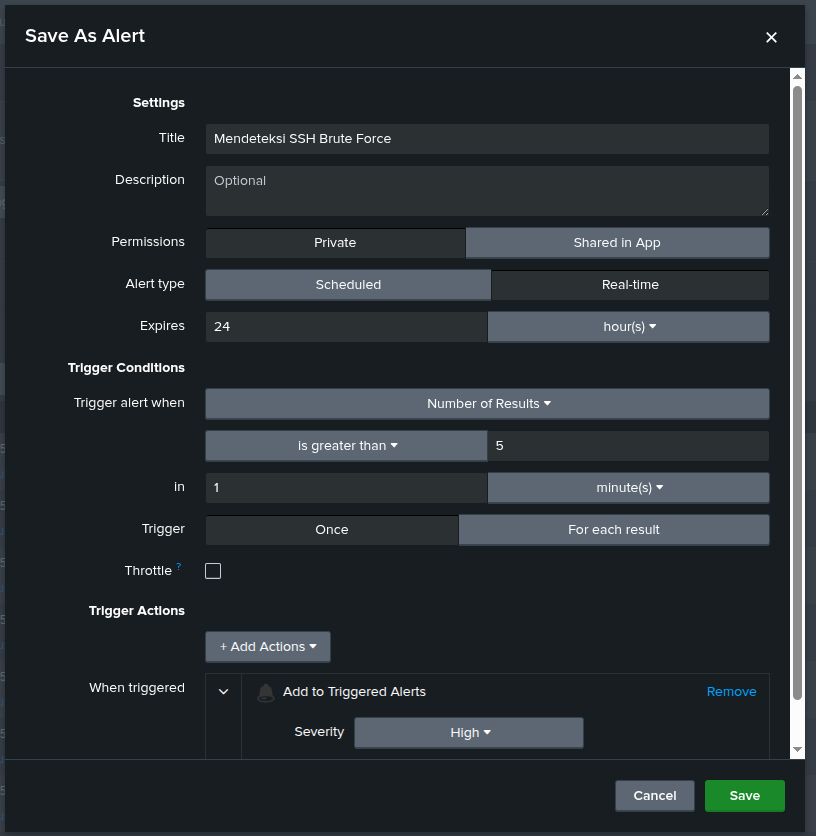

# SIEM Home Lab: Linux Threat Detection & Monitoring with Splunk


## Deskripsi Proyek

Proyek ini adalah simulasi lingkungan *Security Information and Event Management* (SIEM) yang dibangun untuk memantau keamanan *host* Linux (Ubuntu). Tujuan utama dari lab ini adalah melakukan *ingestion* data log autentikasi, menyimulasikan serangan siber secara langsung, dan membangun kapabilitas deteksi (*Threat Hunting*) serta peringatan otomatis.

Selain dari perspektif operasional *Blue Team*, proyek ini juga didokumentasikan untuk memenuhi standar audit dan tata kelola keamanan (GRC), dengan fokus pada evaluasi kepatuhan kontrol akses pengguna.

---

## Teknologi & Lingkungan

| Komponen | Detail |
|---|---|
| **Sistem Operasi** | Ubuntu Linux |
| **SIEM** | Splunk Enterprise (Single Node) |
| **Log Shipper** | Splunk Universal Forwarder |
| **Sumber Data** | `/var/log/auth.log`, `/var/log/syslog` |

---

## Skenario Serangan (Attack Narrative)

Simulasi serangan dilakukan untuk menguji kapabilitas deteksi dengan tahapan berikut:

| Tahap | Teknik | MITRE ID |
|---|---|---|
| **Initial Access** | SSH Brute Force — percobaan login berulang ke sistem | T1110.001 |
| **Privilege Escalation** | Penyalahgunaan `sudo` untuk membuat backdoor account (`sysupdate`) | T1078 |
| **Persistence** | Backdoor account dipertahankan untuk akses jangka panjang | T1136.001 |
| **Execution** | Unduh dan eksekusi skrip dari internet via `curl` di `/tmp` | T1105 |
| **Execution** | Eksekusi skrip via command line (`update.sh`) | T1059 |

---

## MITRE ATT&CK Coverage

| ID | Teknik | Taktik | Deteksi |
|---|---|---|---|
| T1110.001 | Brute Force: Password Guessing | Initial Access | SSH failed login count > threshold |
| T1078 | Valid Accounts (sudo abuse) | Privilege Escalation | sudo COMMAND= curl/chmod di log |
| T1136.001 | Create Account: Local Account | Persistence | useradd/usermod "sysupdate" di log |
| T1105 | Ingress Tool Transfer | Command & Control | curl ke external URL via sudo |
| T1059 | Command and Scripting Interpreter | Execution | Eksekusi skrip di /tmp |

---

## Threat Hunting & SPL Queries

### 1. Mendeteksi SSH Brute Force

```splunk
index="linux_host" "Failed password" sshd
| rex field=_raw "Failed password for (invalid user )?(?<user>\S+) from (?<src_ip>\S+)"
| stats count by user, src_ip
| sort - count
```


### 2. Mendeteksi Pembuatan User Baru (Audit Kepatuhan)

```splunk
index="linux_host" ("useradd" OR "usermod" OR "new group" OR "new user") "sysupdate"
| table _time, _raw
```


### 3. Mendeteksi Eksekusi Sudo yang Mencurigakan

```splunk
index="linux_host" sudo "COMMAND=" ("curl" OR "chmod" OR "update.sh")
| rex field=_raw "USER=(?<run_as_user>\S+).*COMMAND=(?<sudo_command>.*)"
| table _time, user, run_as_user, sudo_command
```


---

## Visualisasi & Dashboard SOC


*Dashboard Linux Security Monitoring — grafik SSH Brute Force dan tabel deteksi perintah Sudo.*


*Konfigurasi Alert otomatis untuk mendeteksi percobaan login gagal yang melebihi ambang batas.*

---

## Laporan Investigasi (Triage Report)

Hasil analisis log diubah menjadi laporan insiden yang berfokus pada mitigasi teknis dan penegakan kebijakan kontrol akses.

[Laporan Triage INC-2026-001](Triage-Report/Laporan_Insiden_001.md)

---

## Struktur Repositori

```
Splunk-SIEM-Linux-Detection/
├── README.md
├── Screenshots/
│   ├── ssh-bruteforce-1.png
│   ├── ssh-bruteforce-2.png
│   ├── useradd.png
│   ├── sudo.png
│   ├── dashboard.png
│   └── alert.png
├── Scripts/
└── Triage-Report/
    └── Laporan_Insiden_001.md
```

---

*Dibuat oleh: Gilang Swandaru | 2026*
